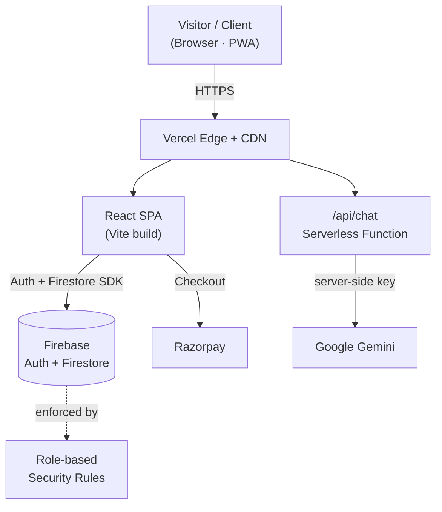

<div align="center">


<br />

# Navneet Yadav — Portfolio & Client Platform

**A production-grade freelance portfolio that doubles as a full client-management platform.**
Marketing site, an AI assistant, authentication, client dashboards, an admin panel and online payments — all in one fast, SEO-optimized React application.

<br />


[**🌐 Live Demo**](https://my-portfolio-nine-eosin-35.vercel.app/) &nbsp;·&nbsp; [**✨ Features**](#-features) &nbsp;·&nbsp; [**🏗️ Architecture**](#️-architecture) &nbsp;·&nbsp; [**🚀 Getting Started**](#-getting-started)

</div>

---

## 📖 Overview

This is my personal developer portfolio — but it is a lot more than a static "about me" page. It is a complete client-facing platform I built to run my freelance business end to end:

- Visitors land on a polished marketing site that showcases my services, skills and work.
- A built-in **AI assistant** answers questions about me 24/7 — and, for signed-in clients, reports on their own project status, payments and timelines.
- Clients can **sign up, pay online, and track their projects** in a personal dashboard.
- I manage everything — users, projects, progress and revenue — from a **role-protected admin panel**.

It's built with React and Vite, backed by Firebase, wired to Google Gemini for AI and Razorpay for payments, and deployed on Vercel with full SEO, PWA and security-header configuration.

> **In short:** one codebase that markets the service, converts the lead, takes the payment, and manages the delivery.

---

## ✨ Features

### 🎯 Marketing Website
- Animated **hero** with a typewriter headline, particle background and glassmorphism UI.
- Sections for **Services, About, Skills, Projects, Testimonials** and **Contact**.
- A detailed **services catalogue** with pricing, feature lists and a clear "how payment works" flow.
- Fully **responsive** dark-theme design with a signature neon-green accent (`#00ff88`).
- Smooth scroll-reveal animations powered by `IntersectionObserver` + Framer Motion.

### 🤖 Hybrid AI Assistant
- A floating chat widget available on every page.
- **Real AI** answers via Google Gemini through a secure serverless function — the API key never touches the browser.
- **Graceful fallback:** if the AI is unavailable, a built-in rule-based engine keeps answering instantly, so the assistant never "breaks."
- **Context-aware for clients:** logged-in users can ask *"What's my project status?"*, *"How much have I paid?"* or *"What's the ETA?"* and get answers pulled live from their own Firestore data.
- Understands **English, Hindi and Hinglish**, and stays on-brand with a concise, professional tone.

### 🔐 Authentication & Accounts
- **Email/Password** and **Google OAuth** sign-in via Firebase Auth.
- Email verification and password-reset flows out of the box.
- A smart **Password Manager**: Google-only users can *set* a password (account linking), while email users can securely *change* theirs after re-authentication.

### 📊 Client Dashboard
- Each client sees only their own projects with **live progress bars**, work status, and paid / remaining amounts.
- At-a-glance summary tiles: total projects, active projects and total paid.
- Milestones, estimated timelines and admin notes per project.

### 👑 Admin Panel
- **Role-based access** (`admin` / `super_admin`) enforced both in the UI and in Firestore rules.
- Live business stats — total **users, projects and revenue**.
- A dedicated **project management** screen to update progress, status, ETA and client-facing notes.

### 💳 Online Payments
- Integrated **Razorpay** checkout with **50% advance** or **full-payment** options.
- On success, a project record is created automatically in Firestore and a printable receipt is generated.

### 🚀 SEO, PWA & Performance
- Rich **SEO**: meta tags, Open Graph, Twitter cards, canonical URL, `sitemap.xml`, `robots.txt`, and **JSON-LD structured data** (`Person`, `WebSite`, `ProfessionalService`, `FAQPage`).
- Installable **PWA** with a web manifest, theme color and app icons.
- **Code-split** by route and vendor, **lazy-loaded** heavy components, non-blocking font loading and immutable asset caching for a fast first paint.

### 🛡️ Security
- **Firestore security rules** with helper functions, per-document ownership checks and **privilege-escalation protection** (users can't make themselves admins).
- Server-side secrets kept out of the client bundle.
- Hardened HTTP **security headers** (`X-Frame-Options`, `X-Content-Type-Options`, `X-XSS-Protection`) via `vercel.json`.

---

## 🛠️ Tech Stack

| Layer | Technologies |
| --- | --- |
| **Framework** | React 18, React Router 7 |
| **Build Tool** | Vite 6 |
| **Styling** | Tailwind CSS 3, custom design tokens, glassmorphism |
| **Animation** | Framer Motion, tsParticles, `typewriter-effect`, `react-parallax-tilt`, `react-scroll` |
| **Icons** | React Icons |
| **Backend / BaaS** | Firebase — Authentication & Cloud Firestore |
| **AI** | Google Gemini (via a Vercel serverless function) |
| **Payments** | Razorpay |
| **Deployment** | Vercel (SPA + serverless) with Firestore rules on Firebase |
| **Tooling** | ESLint, Oxlint, PostCSS, Autoprefixer |

---

## 🏗️ Architecture

The frontend is a single-page React app served from Vercel's CDN. All dynamic data flows through Firebase, while the AI assistant is proxied through a serverless function so the Gemini key stays on the server.



**Key design decisions**

- **Serverless AI proxy** (`api/chat.js`) — keeps the API key private, auto-retries across multiple Gemini models, and enables adaptive "thinking" on newer models.
- **Route guards** — `App.jsx` gates `/dashboard`, `/checkout` and all `/admin/*` routes on auth state and Firestore role.
- **Lazy loading** — auth pages, dashboards, checkout and the AI widget are all `React.lazy` imports, keeping the homepage bundle tiny.
- **Manual chunking** — `react`, `firebase` and `particles` are split into separate vendor chunks for better caching.

---

## 📸 Screenshots

Best experienced live: **[my-portfolio-nine-eosin-35.vercel.app](https://my-portfolio-nine-eosin-35.vercel.app/)**

| Landing / Hero | AI Assistant | Client Dashboard |
| :---: | :---: | :---: |
| Animated hero + services | Context-aware chat | Project tracking & payments |

<!-- Tip: drop real screenshots into /public and reference them here, e.g.  -->

---

## 🚀 Getting Started

### Prerequisites
- **Node.js 18+** (Node 20 LTS recommended)
- **npm** (ships with Node)
- A **Firebase** project (Auth + Firestore)
- *Optional:* a **Google Gemini** API key for the AI assistant and a **Razorpay** key for payments

### 1. Clone & install

```bash
git clone https://github.com/navneetyadav8070/my-portfolio.git
cd my-portfolio
npm install
```

### 2. Configure environment

```bash
cp .env.example .env
```

Fill in your values (see [Environment Variables](#-environment-variables) below). The Firebase web config has safe fallbacks baked in, so the app will run out of the box — but use your own project for anything real.

### 3. Run the dev server

```bash
npm run dev
```

Open **http://localhost:5173** in your browser.

### 4. Build for production

```bash
npm run build   # outputs to dist/
npm run preview # serve the production build locally
```

---

## 🔑 Environment Variables

Copy `.env.example` → `.env` and fill these in. Client (`VITE_*`) variables are bundled into the frontend; the Gemini key stays **server-side only**.

| Variable | Scope | Required | Description |
| --- | --- | :---: | --- |
| `VITE_FIREBASE_API_KEY` | Client | ● | Firebase web API key |
| `VITE_FIREBASE_AUTH_DOMAIN` | Client | ● | Firebase auth domain |
| `VITE_FIREBASE_PROJECT_ID` | Client | ● | Firebase project ID |
| `VITE_FIREBASE_STORAGE_BUCKET` | Client | ● | Firebase storage bucket |
| `VITE_FIREBASE_MESSAGING_SENDER_ID` | Client | ● | Firebase messaging sender ID |
| `VITE_FIREBASE_APP_ID` | Client | ● | Firebase app ID |
| `GEMINI_API_KEY` | Server | ○ | Google Gemini key for the AI assistant ([get one free](https://aistudio.google.com/apikey)) |
| `GEMINI_MODEL` | Server | ○ | Optional model override (defaults to `gemini-2.0-flash`) |

> ● required · ○ optional. On Vercel, add these under **Settings → Environment Variables**. Never commit real secrets — `.env*` is git-ignored.

---

## 📁 Project Structure

```
my-portfolio/
├── api/
│   └── chat.js                 # Serverless function → Google Gemini (AI backend)
├── public/
│   ├── og-image.png            # Social share card (also this README's banner)
│   ├── site.webmanifest        # PWA manifest
│   ├── robots.txt · sitemap.xml
│   └── favicon.svg · icon-512.png
├── src/
│   ├── components/             # UI + homepage sections
│   │   ├── AIAssistant.jsx     # Floating hybrid AI chat widget
│   │   ├── Checkout.jsx        # Razorpay payment flow
│   │   ├── Hero.jsx · Services.jsx · Skills.jsx · Projects.jsx
│   │   ├── About.jsx · Testimonials.jsx · Contact.jsx · Footer.jsx
│   │   ├── Navbar.jsx · ScrollToTop.jsx · LoadingScreen.jsx
│   │   ├── ParticlesBackground.jsx
│   │   └── PasswordManager.jsx
│   ├── firebase/
│   │   └── config.js           # Firebase init + auth & Firestore helpers
│   ├── pages/
│   │   ├── Dashboard.jsx        # Client dashboard
│   │   ├── AdminDashboard.jsx   # Admin overview & stats
│   │   ├── admin/ManageProjects.jsx
│   │   └── auth/LoginPage.jsx · RegisterPage.jsx
│   ├── App.jsx                 # Routes, auth state & route guards
│   └── main.jsx                # App entry
├── firestore.rules            # Role-based Firestore security rules
├── vercel.json                # Rewrites, caching & security headers
├── vite.config.js             # Build config + manual chunk splitting
├── tailwind.config.js         # Design tokens (theme, accent, animations)
└── .env.example
```

---

## 📜 Available Scripts

| Command | Description |
| --- | --- |
| `npm run dev` | Start the Vite dev server with HMR |
| `npm run build` | Create an optimized production build in `dist/` |
| `npm run preview` | Preview the production build locally |
| `npm run lint` | Lint the codebase with ESLint |
| `npm run format` | Format `src/` with Prettier |

---

## ☁️ Deployment

The app deploys to **Vercel** with zero extra configuration — `vercel.json` handles SPA rewrites, long-term asset caching and security headers.

1. Push this repository to GitHub.
2. Import it into Vercel (framework preset: **Vite**).
3. Add your environment variables in **Settings → Environment Variables**.
4. Deploy — Vercel runs `npm run build` and serves `dist/` plus the `/api` function.

**Firestore rules** are deployed separately with the Firebase CLI:

```bash
firebase deploy --only firestore:rules
```

---

## 🗺️ Roadmap

- [ ] Server-side Razorpay signature verification (webhook-based order confirmation)
- [ ] In-dashboard invoices & downloadable PDF receipts
- [ ] Email / push notifications on project status changes
- [ ] Blog / case studies section for deeper SEO
- [ ] Automated tests (Vitest + React Testing Library)

---

## 👤 Author

**Navneet Yadav** — Freelance Full Stack Developer & Digital Marketer
📍 Greater Noida, India · Available for remote work worldwide

[](https://my-portfolio-nine-eosin-35.vercel.app/)
[](https://github.com/navneetyadav8070)
[](https://linkedin.com/in/navneetyadav)
[](mailto:Navneetyadav8070@gmail.com)

Have a project in mind? I'd love to hear about it.

---

## 📄 License

This is a personal portfolio project. The code is shared publicly for reference and to demonstrate my work. Please don't republish it as your own portfolio — but feel free to explore it for ideas and learning.

© 2026 Navneet Yadav. All rights reserved.

<div align="center">

**⭐ If this project inspired you, consider giving it a star.**

</div>
