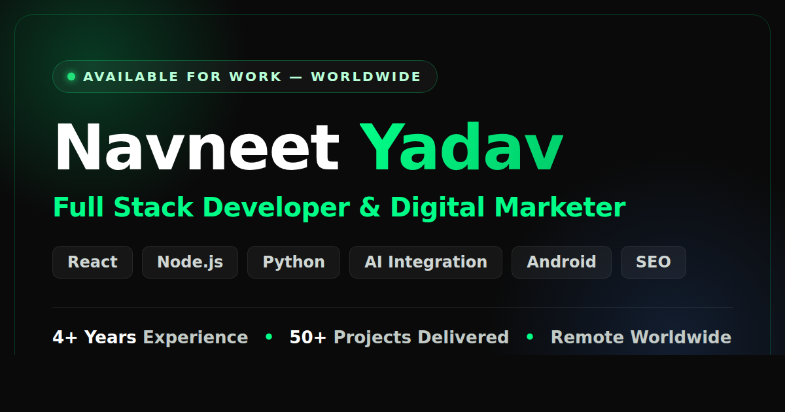
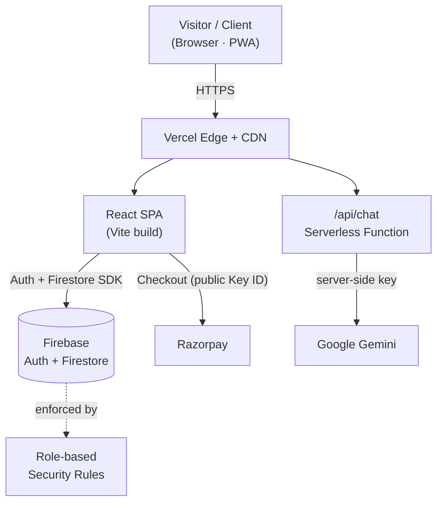

<div align="center">



<br />

# Navneet Yadav — Portfolio & Client Platform

**A freelance portfolio that also runs my business.**

Marketing site, AI assistant, authentication, client dashboards, an admin panel and online payments — one React codebase, deployed on Vercel.

<br />


[**🌐 Live Site**](https://my-portfolio-nine-eosin-35.vercel.app/)
&nbsp;·&nbsp; [**Features**](#-what-it-does)
&nbsp;·&nbsp; [**Architecture**](#️-architecture)
&nbsp;·&nbsp; [**Engineering Decisions**](#-engineering-decisions)
&nbsp;·&nbsp; [**Getting Started**](#-getting-started)

</div>

---

## 📖 Why I built this

Most developer portfolios stop at "here's my work, here's my email." Mine doesn't — because a portfolio that only *shows* work still leaves me doing every other part of the job by hand: quoting over WhatsApp, chasing payments, and answering the same five questions for every new lead.

So I built the whole pipeline into one product:

| Stage | What the site does |
| --- | --- |
| **Attract** | SEO-optimized marketing site with structured data, OG cards and a sitemap |
| **Qualify** | An AI assistant that answers questions about my services 24/7, in English, Hindi or Hinglish |
| **Convert** | A services catalogue with transparent pricing and a built-in Razorpay checkout |
| **Deliver** | Clients sign in and track project status, milestones, progress and balance in their own dashboard |
| **Manage** | I run users, projects, progress and revenue from a role-protected admin panel |

One codebase markets the service, converts the lead, takes the payment, and manages the delivery. That framing drove every technical decision below.

---

## ✨ What it does

### 🎯 Marketing site
- Animated hero with a typewriter headline, an interactive particle network and a glassmorphism UI.
- Sections for **Services, About, Skills, Projects, Testimonials** and **Contact**.
- A services catalogue with pricing bands, feature lists, delivery timelines and a clear "how payment works" flow.
- Fully responsive dark theme built on a custom Tailwind token set with a signature `#00ff88` accent.
- Scroll-reveal animations driven by `IntersectionObserver` — with a `rootMargin` pre-trigger so sections are never blank mid-scroll on mobile, plus a fallback that reveals everything immediately if the browser has no observer support.

### 🤖 Hybrid AI assistant
This is the part I'm most pleased with, because it's designed to **never** show a visitor an error.

- A floating chat widget on every page, backed by **Google Gemini** through a serverless function.
- **The API key never reaches the browser.** The browser talks to `/api/chat`; only the server talks to Gemini.
- **Model failover:** the function walks a list of candidate Gemini models and uses the first that responds, so a deprecated model name degrades instead of breaking.
- **Rule-based fallback:** if the AI is unreachable, out of quota, or not configured at all, a built-in intent matcher answers instantly from local knowledge. The visitor sees a working assistant either way.
- **Context-aware for clients:** a signed-in client can ask *"What's my project status?"*, *"How much do I still owe?"* or *"What's the ETA?"* — and the answer is built from their own Firestore records, injected server-side as context rather than invented by the model.

### 🔐 Authentication & accounts
- **Email/password** and **Google OAuth** via Firebase Auth.
- Email verification and password reset flows.
- A password manager that handles the awkward case properly: a Google-only account has no password credential, so the UI offers **Set password** (linking an `EmailAuthProvider` credential) instead of **Change password** — and transparently re-authenticates via popup when Firebase demands a recent login.

### 💳 Payments & client dashboard
- **Razorpay** checkout supporting a 50% advance or full payment, with the balance tracked automatically.
- On success the project is created in Firestore with default milestones, work status and ETA.
- Clients get a dashboard with progress bars, milestone checklists, payment history and a printable receipt.

### 🛠️ Admin panel
- Role-gated overview of users, projects, revenue and outstanding balances.
- Inline editing of work status, progress percentage, milestones, ETA and client-facing notes — changes surface in the client's dashboard and in the AI assistant's answers immediately.

---

## 🧰 Tech Stack

| Layer | Technologies |
| --- | --- |
| **Framework** | React 18, React Router 7 |
| **Build** | Vite 6 |
| **Styling** | Tailwind CSS 3, custom design tokens, glassmorphism |
| **Animation** | Framer Motion, tsParticles, `typewriter-effect`, `react-parallax-tilt`, `react-scroll` |
| **Icons** | React Icons (Font Awesome + Feather) |
| **Backend** | Firebase — Authentication & Cloud Firestore |
| **AI** | Google Gemini, via a Vercel serverless function |
| **Payments** | Razorpay Checkout |
| **Hosting** | Vercel (static SPA + serverless functions); Firestore rules deployed via Firebase CLI |
| **Tooling** | ESLint 9 (flat config), Prettier, PostCSS, Autoprefixer |

---

## 🏗️ Architecture

The frontend is a single-page React app served from Vercel's CDN. Dynamic data goes straight from the client to Firebase, guarded by security rules. The AI is the one thing that is deliberately *not* client-direct — it routes through a serverless function so the Gemini key stays on the server.



---

## 🧠 Engineering Decisions

The parts of this project I'd actually want to talk through in an interview.

**1. The AI degrades, it never breaks.**
Three layers of fallback: candidate-model failover inside the function, an HTTP failure path in the client, and a local rule-based responder underneath both. A missing `GEMINI_API_KEY` produces a working assistant, not a broken widget. I'd rather ship a slightly less clever answer than a red error bubble in front of a paying lead.

**2. Secrets are split by trust boundary, not by convenience.**
`VITE_*` variables are compiled into the bundle and are therefore public by definition — so only genuinely public values live there (Firebase web config, the Razorpay **Key ID**). The Gemini key has no `VITE_` prefix precisely so it stays server-side, read from `process.env` inside the function. The Razorpay **Key Secret** never enters this repository at all.

**3. Authorization is enforced at the database, not in the UI.**
Route guards in `App.jsx` are UX, not security — anyone can edit client-side state. The real boundary is `firestore.rules`: clients can only read documents whose `clientEmail` matches their own auth token, and only admins can write project status. The rules also block privilege escalation explicitly — a user updating their own document cannot change their own `role` or `status`.

**4. Code splitting follows the visitor, not the file tree.**
Someone reading the homepage should not download the admin panel. Auth pages, both dashboards, checkout, project management and the AI widget are all `React.lazy` imports, and vendor libraries are split into separately-cacheable chunks so a content change doesn't invalidate React or Firebase in the browser cache.

```
Loaded on the homepage        Loaded only when needed
──────────────────────        ───────────────────────
index      90.8 kB gzip       particles     34.6 kB gzip
firebase  174.2 kB gzip       ManageProjects 3.8 kB gzip
vendor     59.6 kB gzip       AIAssistant    3.7 kB gzip
CSS         8.2 kB gzip       Checkout       3.2 kB gzip
                              Dashboard      2.8 kB gzip
                              LoginPage      1.4 kB gzip
```

The honest read on that table: the Firebase SDK is the heaviest thing on the homepage, because `App.jsx` subscribes to auth state on mount. Deferring Firebase initialization until a route actually needs it is the biggest remaining win, and it's on the roadmap below.

**5. The AI widget gets its own Suspense boundary.**
A `React.lazy` component without a nearby boundary bubbles up to the nearest one — which would have put the entire homepage behind a spinner while a chat button downloaded. It's wrapped in `<Suspense fallback={null}>` so it loads silently in the background instead.

**6. SEO was built in, not bolted on.**
A JSON-LD `@graph` describing `Person`, `WebSite`, `ProfessionalService` and `FAQPage`; a canonical URL; Open Graph and Twitter cards with a 1200×630 image; a `robots.txt` that deliberately keeps `/login`, `/dashboard`, `/admin` and `/checkout` out of the index; a sitemap; and a PWA manifest. Fonts are preloaded non-blocking with `display=swap` so text paints immediately.

---

## 🚀 Getting Started

### Prerequisites
- **Node.js 18+** (20 LTS recommended)
- A **Firebase** project with Authentication and Firestore enabled
- *Optional:* a **Google Gemini** API key (free tier) and a **Razorpay** account

### 1. Clone and install

```bash
git clone https://github.com/navneetyadav8070/my-portfolio.git
cd my-portfolio
npm install
```

### 2. Configure environment

```bash
cp .env.example .env
```

Fill in your values — see [Environment Variables](#-environment-variables). The Firebase web config has fallbacks baked in so the app boots out of the box, but point it at your own project for anything real.

### 3. Run

```bash
npm run dev      # dev server with HMR → http://localhost:5173
npm run build    # production build → dist/
npm run preview  # serve the production build locally
```

> **Note:** `/api/chat` is a Vercel serverless function, so the AI assistant needs `vercel dev` (or a deployment) to respond. Under plain `npm run dev` the request fails and the rule-based fallback answers instead — which is exactly the behaviour it's designed for.

---

## 🔑 Environment Variables

| Variable | Scope | Required | Description |
| --- | --- | :---: | --- |
| `VITE_FIREBASE_API_KEY` | Client | ● | Firebase web API key |
| `VITE_FIREBASE_AUTH_DOMAIN` | Client | ● | Firebase auth domain |
| `VITE_FIREBASE_PROJECT_ID` | Client | ● | Firebase project ID |
| `VITE_FIREBASE_STORAGE_BUCKET` | Client | ● | Firebase storage bucket |
| `VITE_FIREBASE_MESSAGING_SENDER_ID` | Client | ● | Firebase messaging sender ID |
| `VITE_FIREBASE_APP_ID` | Client | ● | Firebase app ID |
| `VITE_RAZORPAY_KEY_ID` | Client | ○ | Razorpay **Key ID** — `rzp_test_…` or `rzp_live_…`. Falls back to a test key |
| `GEMINI_API_KEY` | **Server** | ○ | Gemini key for the AI assistant ([free key](https://aistudio.google.com/apikey)) |
| `GEMINI_MODEL` | **Server** | ○ | Model override (defaults to `gemini-2.0-flash`) |

● required · ○ optional

> **On secrets:** anything prefixed `VITE_` is bundled into the JavaScript shipped to the browser and is therefore public. That's fine for the Firebase web config and the Razorpay Key ID — both are designed to be public, and are protected by security rules and server-side verification respectively. Your Razorpay **Key Secret** belongs in neither list. On Vercel, add these under **Settings → Environment Variables**; `.env*` is git-ignored.

---

## 📁 Project Structure

```
my-portfolio/
├── api/
│   └── chat.js                  # Serverless function → Gemini (model failover, server-side key)
├── public/
│   ├── og-image.png             # Social share card (and this README's banner)
│   ├── site.webmanifest         # PWA manifest
│   ├── robots.txt · sitemap.xml # Crawl rules + sitemap
│   └── favicon.svg · icon-512.png
├── src/
│   ├── components/
│   │   ├── AIAssistant.jsx      # Hybrid AI chat widget (Gemini + rule-based fallback)
│   │   ├── Checkout.jsx         # Razorpay payment flow
│   │   ├── PasswordManager.jsx  # Set / change password, incl. Google-only accounts
│   │   ├── Hero.jsx · Services.jsx · Skills.jsx · Projects.jsx
│   │   ├── About.jsx · Testimonials.jsx · Contact.jsx · Footer.jsx
│   │   ├── Navbar.jsx · ScrollToTop.jsx · LoadingScreen.jsx
│   │   └── ParticlesBackground.jsx
│   ├── firebase/
│   │   └── config.js            # Firebase init + auth & Firestore helpers
│   ├── pages/
│   │   ├── Dashboard.jsx        # Client dashboard — progress, milestones, payments
│   │   ├── AdminDashboard.jsx   # Admin overview & revenue stats
│   │   ├── admin/ManageProjects.jsx
│   │   └── auth/LoginPage.jsx · RegisterPage.jsx
│   ├── App.jsx                  # Routes, auth state, role-based route guards
│   └── main.jsx
├── firestore.rules              # Role-based security rules (the real authorization boundary)
├── vercel.json                  # SPA rewrites, asset caching, security headers
├── vite.config.js               # Build config + manual vendor chunking
├── eslint.config.js             # ESLint 9 flat config
└── tailwind.config.js           # Design tokens, theme, animations
```

---

## 📜 Scripts

| Command | Description |
| --- | --- |
| `npm run dev` | Vite dev server with HMR |
| `npm run build` | Optimized production build → `dist/` |
| `npm run preview` | Serve the production build locally |
| `npm run lint` | Lint with ESLint 9 (flat config) |
| `npm run format` | Format `src/` with Prettier |

---

## ☁️ Deployment

Deployed on **Vercel**. `vercel.json` handles SPA rewrites, immutable asset caching and security headers (`X-Content-Type-Options`, `X-Frame-Options`, `Referrer-Policy`, `Permissions-Policy`, `Strict-Transport-Security`).

1. Push to GitHub.
2. Import the repo into Vercel — framework preset **Vite**.
3. Add the environment variables under **Settings → Environment Variables**.
4. Deploy. Vercel runs `npm run build`, serves `dist/`, and hosts `/api/chat` as a function.

Firestore rules deploy separately:

```bash
firebase deploy --only firestore:rules
```

---

## 🗺️ Roadmap

- [ ] **Server-side Razorpay verification** — a webhook that validates the payment signature before the project document is written, so the amount can't be forged client-side
- [ ] **Lazy Firebase initialization** — the largest remaining bundle win on the homepage
- [ ] Move the contact form off `mailto:` to a serverless handler with Firestore persistence
- [ ] In-dashboard invoices and downloadable PDF receipts
- [ ] Email / push notifications on project status changes
- [ ] Automated tests (Vitest + React Testing Library)

---

## 👤 Author

**Navneet Yadav** — Freelance Full Stack Developer & Digital Marketer
📍 Greater Noida, India · Available for remote work worldwide

[](https://my-portfolio-nine-eosin-35.vercel.app/)
[](https://www.linkedin.com/in/navneet-yadav-82b601425)
[](https://github.com/navneetyadav8070)
[](mailto:Navneetyadav8070@gmail.com)

If you're hiring, or you have a project in mind — I'd genuinely like to hear about it.

---

## 📄 License

Personal portfolio project. The code is public so you can read how it works and borrow ideas — please don't republish it as your own portfolio.

© 2026 Navneet Yadav. All rights reserved.

<div align="center">

**⭐ If this gave you an idea for your own project, a star is appreciated.**

</div>
